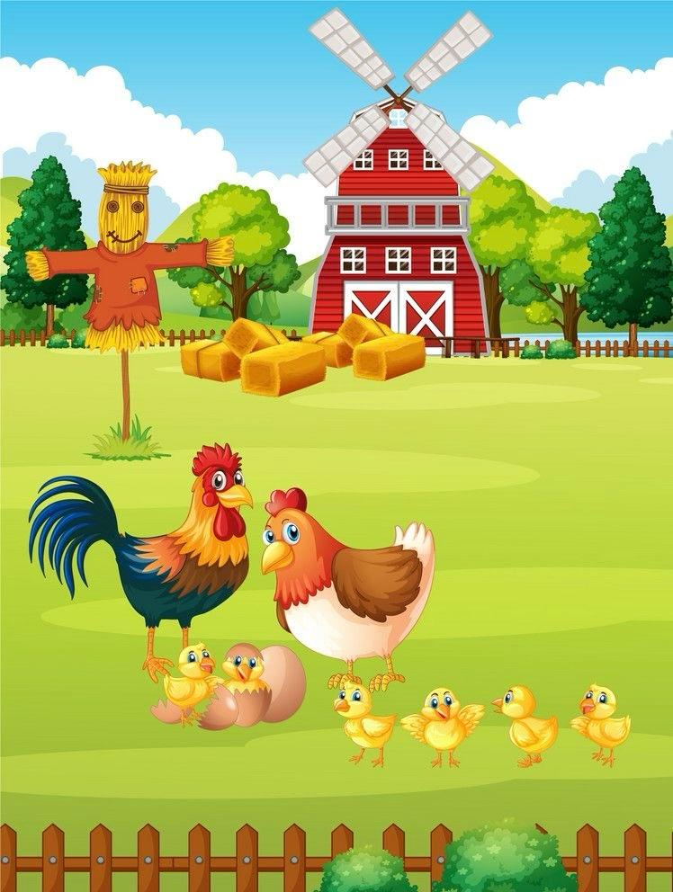

# 🥚 Egg Catching Game – Arcade-Style Pygame Project 🎮

A fun and interactive 2D arcade game where the player controls a basket to catch falling eggs. Built using Python and Pygame, this game features real-time motion, scorekeeping, increasing difficulty, and custom visuals with sound effects.

---

## 🎮 Gameplay Overview

- Move the basket left/right using **arrow keys**
- Catch the falling eggs to increase your score
- Miss an egg and it’s **Game Over!**
- Press **R** to retry or **Q** to quit

---

## 🧠 Features

- Real-time game logic with collision detection
- Increasing difficulty as score grows
- Start screen and Game Over screen
- Background music and game sounds
- Uses Pygame for graphics and event handling

---

## 📸 Screenshots

### Start Screen

### Gameplay

### Game Assets
- Egg Image: `Easter_Egg.png`  
- Basket Image: `Basket1.png`

---

## 🔊 Sound Effects

- Catch Sound: `mixkit-message-pop-alert-2354.mp3`  
- Game Over Sound: `mixkit-player-losing-or-failing-2042.wav`

These audio cues make gameplay more immersive and responsive.

---

## 📁 Assets Used

| File Name                                 | Description              |
|------------------------------------------|--------------------------|
| `egg FC.jpg`                              | Start screen image       |
| `BG.jpg`                                  | Background image         |
| `Easter_Egg.png`                          | Egg graphic              |
| `Basket1.png`                             | Basket graphic           |
| `mixkit-message-pop-alert-2354.mp3`       | Catch sound              |
| `mixkit-player-losing-or-failing-2042.wav`| Game over sound          |

---

## 🛠️ Technologies Used

- **Language:** Python 3  
- **Library:** Pygame  
- **Platform:** Jupyter Notebook and `.py` executable  

---

## 📌 Notes

✅ Solo project for hands-on game dev learning  
🎓 Built as part of academic & personal exploration  
🎮 Fully functional and tested with visuals + audio  
📁 All files are included for complete reproducibility

---
---

## 🎨 Credits & Licensing

- Images and sounds used in this game were sourced from free online platforms and are used here for educational and non-commercial purposes only.
- I do not claim ownership of these assets.

**Made with 💻 & 🎮 by Mariam Shariff**
